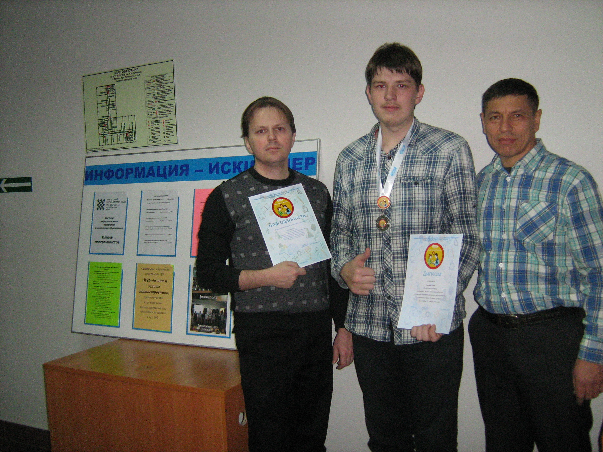
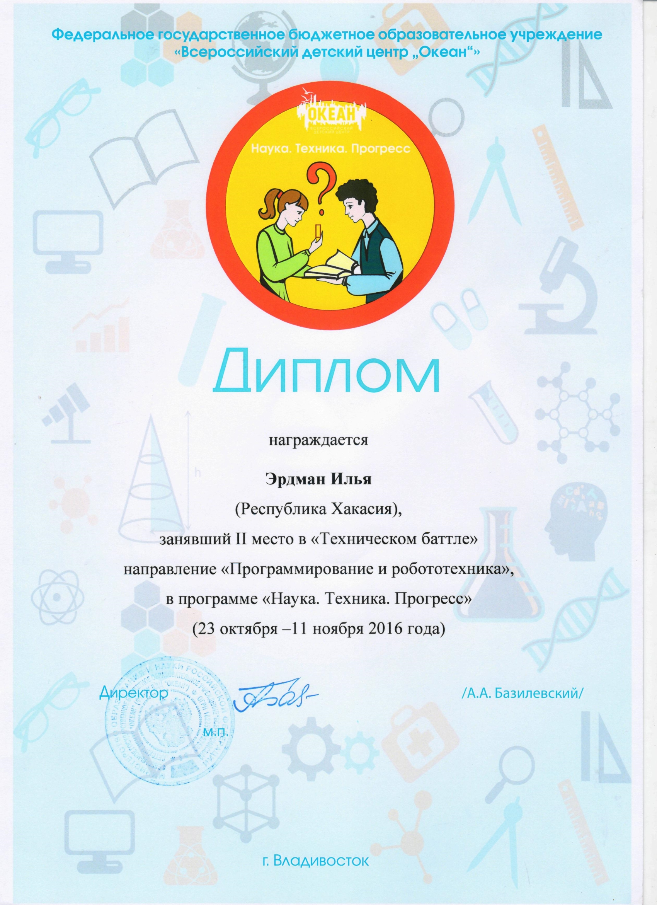

# Слушатель Школы программистов ХГУ им. Н.Ф. Катанова Илья Эрдман занял 2 место в «Техническом баттле» по направлению «Программирование и робототехника»

Дата создания: 2016-11-14

Автор: veronikaAL

Теги: Школа Программистов,Робототехника,Программирование,Школьники

 

 Слушатель Школы программистов ХГУ им. Н.Ф. Катанова Илья Эрдман, ученик 11 класса МБОУ СОШ №20 г. Абакана занял 2 место в «Техническом баттле» по направлению «Программирование и робототехника» в программе «Наука. Техника. Прогресс» в ФГБОУ «Всероссийский детский центр «Океан»  
  
Особая атмосфера встречи после каникул, обмена впечатлениями царила 12 ноября во всех аудиториях Школы программистов. Но в аудитории 504, где занимается группа слушателей программы дополнительного образования «Конструирование электронных устройств и программирование микроконтроллеров», особое оживление.  
  
Из «Всероссийского детского центра «Океан» с победой вернулся Илья Эрдман. Путевка в Океан – награда Министерства образования и науки РХ лауреату 3-его Открытого фестиваля «От робота к Роботу» и многочисленных выставок технического творчества в Хакасии в 2016г. Диплом и медаль за второе место в «Техническом баттле» по направлению «Программирование и робототехника» в программе «Наука. Техника. Прогресс» – убедительное доказательство того, что Илья заслуженно получил путевку во Всероссийский детский центр «Океан» именно на смену, в которой собрались победители конкурсных мероприятий по техническому творчеству и достойно представлял там Хакасию.  
  
С особым удовольствием и даже гордостью Илья рассказал друзьям о том, что на всех занятиях в «Океане» ему было приятно сознавать, что все это он уже изучал в Абакане. По мнению Ильи Эрдмана, соревнования, в которых ему довелось участвовать в Хакасии, были не менее, а даже более увлекательными и содержательными. Завершился рассказ фотографированием нашего дипломанта и медалиста Ильи Эрдмана с его руководителями Тимуром Николаевичем Вишняковым и Владимиром Малтыгасовичем Тохтобиным.  
  
Впереди новые проекты, новые победы и главное для Ильи, выпускника 2017, правильный выбор сферы своей профессиональной деятельности, выбор рационального маршрута к профессиональной карьере.

