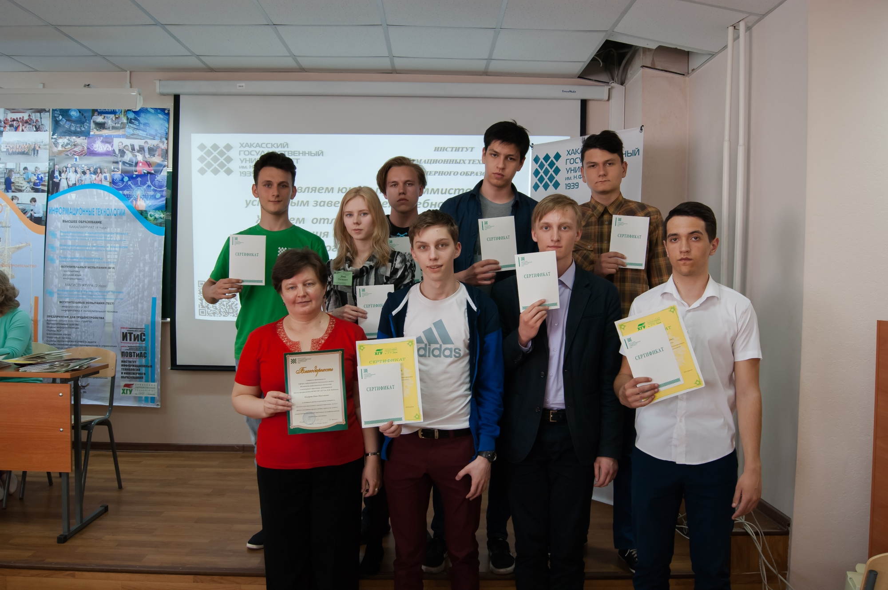

# Завершился 6-ой учебный год в Школе программистов

Дата создания: 2017-05-03

Автор: veronikaAL

Теги: Школа Программистов,ХГУ,Программирование,Школьники

 

 

 

 

 29 апреля в Школе программистов завершился учебный год. Как и в первый день занятий в Школе программистов 8 октября, в 523 аудитории нового корпуса собрались школьники, студенты, преподаватели и некоторые выпускники ИИТИО.  
  
   
  
В таком составе по традиции собираются участники всех мероприятий в Школе программистов. Впервые в этом учебном году вручения документов, подтверждающих освоения программ дополнительного образования, вместе со школьниками ожидают и студенты. Они могут не только обучаться по программе ДО, но и, обучаясь по одной образовательной программе, осваивать и другую. А работающие специалисты обучались здесь же, в ИИТИО по программам повышения квалификации, разработанным с учетом профессиональных образовательных потребностей слушателей, в основном, педагогов: «Образовательная робототехника на основе современной микропроцессорной технологии», «Веб-дизайн и основы сайтостроения». Они стали обладателями соответствующих удостоверений.  
  
   
  
Школьники, обычно, начинают обучение с программ ДО: «Программирование в системе PascalABC» и «Основы робототехники».  
  
   
  
Некоторые программы с интересом, одинаковым успехом и даже в одних группах изучают и школьники, и студенты: «Конструирование электронных устройств и программирование микроконтроллеров», «Решение задач по программированию на языках С и C#», «Проектирование баз данных в СУБД Microsoft SQL Server 2012 и выполнение базовых операций с данными».  
  
   
  
Скорее всего, именно в том и заключается выигрышная особенность освоения программ ДО в Школе программистов в ИИТИО, что школьники, студенты, преподаватели, а на многих мероприятиях и выпускники информационных направлений подготовки-основатели, руководители и ведущие специалисты информационных компаний постоянно рядом. Школьники и студенты понимают, что они нужны в развивающихся перспективных компаниях здесь, в своем регионе. Но нужны не любые с дипломом, а стремящиеся к знаниям, инициативные и ответственные. А представители компаний среди студентов и школьников на олимпиадах, турнирах и фестивалях ищут способных и инициативных. Поддерживают их, чтобы в будущем пригласить в свои компании.  
  
   
  
29 апреля 140 слушателей стали обладателями документов, подтверждающих освоение соответствующих программ дополнительного образования. С начала учебного года только подтвердивших освоение программы уже 160. Следует отметить, что некоторые школьники и студенты не дошли до этого счастливого момента. Но, к счастью, таких немного.

