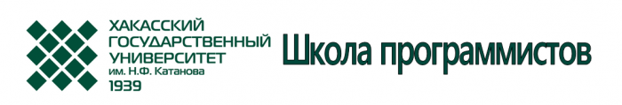

# Набор в Школу программистов на 2017/2018 учебный год

Дата создания: 2017-09-14

Автор: veronikaAL

Теги: Школа Программистов,ХГУ,Школьники,Программирование

   
 Производится набор в Школу программистов, комплектование групп школьников для обучения по программам дополнительного образования:  

- Программирование в системе Pascal ABC
- Решение задач по программированию на языке C#
- Подготовка к ЕГЭ по информатике и ИКТ
- Конструирование электронных устройств и программирование микроконтроллеров

  
**Запись на курсы до 6.10.2017. Начало занятий 7.10.2017**  
  
Справки об условиях зачисления и обучения в Школе программистов по телефонам 89232166514, 89135458146 или по адресу: erna19@mail.ru.   
Заявки на обучение направлять по адресу: г. Абакан, пр. Ленина, 92/1 (новый корпус), каб.401 или на эл.почту: erna19@mail.ru.