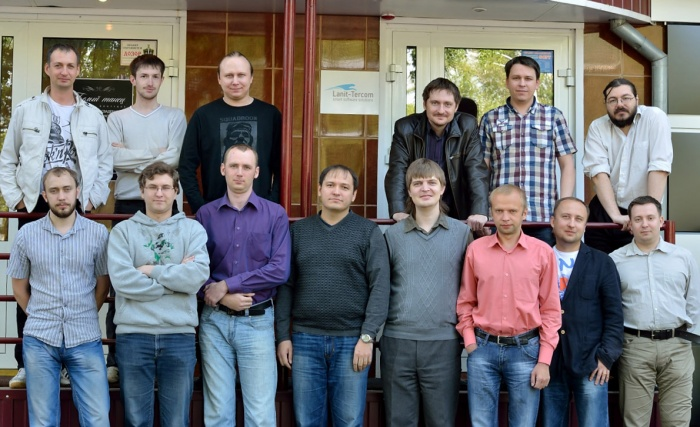

# Ланит-Терком: арбайтсглёд по-абакански

Дата создания: 2013-12-25

Автор: ngrebenshikov

Теги: Ланит-Терком,Компании

Коллеги, я хотел бы рассказать о компании, в которой я сейчас работаю — о компании Ланит-Терком.

- Компания «Ланит-Терком» занимается разработкой программного обеспечения.
- Головной офис находится в Санкт-Петербурге.
- Количество сотрудников: перевалило за 200.

   
   
  
В датском языке есть слово **arbejdsglæde /арбайтсглёд/**. Оно означает удовольствие от работы. То чувство, когда тебе нравится, что ты делаешь, и ты можешь гордиться результатами. Тебе нравятся коллеги — у вас дружная атмосфера. Когда просыпаешься утром, и думаешь: «Отлично! Опять идти на работу!».  
  

> Введение в датский язык оказалось здесь не случайно, на мой взгляд понятие «арбайтсглёд» более всего характеризует абаканский центр разработки компании Ланит-Терком.

  

#### История
  
 Компания была образована в 1991 году по инициативе [Андрея Николаевича Терехова](http://www.math.spbu.ru/user/ant/) (на фото слева) на базе кафедры системного программирования математико-механического факультета СПбГУ. Тогда она называлась ГУП «Терком». В 1998 компания «Терком» присоединилась к Группе Компаний ЛАНИТ, крупнейшему российскому системному интегратору, и сменила имя на «Ланит-Терком». [Подробнее об истории головного филиала.](http://www.lanit-tercom.com/ru/about/history)  
  
Первый программист, работающий на компанию Ланит-Терком в Абакане, появился в 2008 году. Им был ваш покорный слуга. В то время я работал над совместным проектом компаний Ланит-Терком и [Area9](http://www.area9.dk) — редактором интеллект-карт [Comapping](http://www.comapping.com).  
  
Второй программист у нас появился только в 2010 году. А затем все закрутилось: 2011 — 6 программистов, 2012 — 13 программистов, 2013 — 17 программистов.  
  

#### Рабочие моменты
  

##### Текущие проекты
  
На сегодня в абаканском подразделении ведутся работы для трех заказчиков: Area9 (Дания), Allscripts (США) в прошлом dbMotion (Израиль), Sixt (Германия).  
  
[**Area9**](http://area9learning.com/) ведет разработку различных программных продуктов. В основном они связаны с обучением. Например, абаканские разработчики участвуют в разработке таких систем как:  

- [LearnSmart](http://area9learning.com/learnsmart.html) — система адаптивного дистанционного обучения;
- [SmartBuilder](http://area9learning.com/smartbuilder.html) — система коллективной подготовки материалов для систем дистанционного адаптивного обучения;
- [Comapping](http://area9learning.com/comapping.html) — онлайн система совместного управления [интеллект-картами](http://ru.wikipedia.org/wiki/%D0%94%D0%B8%D0%B0%D0%B3%D1%80%D0%B0%D0%BC%D0%BC%D0%B0_%D1%81%D0%B2%D1%8F%D0%B7%D0%B5%D0%B9).

  
[**Allscripts**](http://www.allscripts.com/) является разработчиком программного обеспечения в области медицины. В 2013 году данная компания приобрела компанию [dbMotion](http://dbmotion.com/), для которой абаканские разработчики помогали и помогают развивать такие продукты как:  

- [dbMotion Clinical Views](http://dbmotion.com/solutions/clinical-views/) — веб-портал, объединяющий записи о пациентах, собранные из многих лечебных учреждений;
- [dbMotion Collaborate](http://dbmotion.com/solutions/collaborate/) — система помогающая клиническим и врачам из больниц координировать свои действия в лечении пациентов;
- [dbMotion EHR Agent](http://dbmotion.com/solutions/ehr-agent/) — система, которая позволяет врачам быстро получить доступ к информации о пациенте от других лечебных учреждений.

  
[**Sixt**](http://www.sixt.com/) является одной из крупнейших компаний, специализирующихся на сдаче автомобилей в аренду. В силу своих размеров Sixt приходится детально автоматизировать свои внутренние процессы. Как раз в этом им помогаем мы.  
  

##### Технологии
  
Мы любим и используем разные технологии в своем процессе. Например, в разных проектах у нас используются такие языки программирования как [C#](http://learnxinyminutes.com/docs/csharp/), [Javascript](http://learnxinyminutes.com/docs/javascript/), [PHP](http://learnxinyminutes.com/docs/php/), [Haxe](http://learnxinyminutes.com/docs/haxe/) и конечно же Flow (функциональный язык разработанный в недрах компаний Area9 и Ланит-Терком).  
  
**Сравнение Javascript и Flow**  

```
// Javascript // flow

var constant = 1; constant = 1;

var s = "Hello world"; s = "Hello world";
var s2 = "#" + 1; s2 = "#" + i2s(1);
var ar = [1,2,3]; ar = [1,2,3];

var n = 1 + 1.5; n = 1.0 + 1.5;

var a = 1; a = ref 1;
var b = a; b = ^a;
a = 2; a := 2;
var c = a; c = ^a;
a++; a := 1 + ^a;

if (meaning) 42 else -1; if (meaning) 42 else -1;
var d = 1 < 2 ? 0 : 1; d = if (1 < 2) 0 else 1;

function one() { return 1; } one() { 1 }
function twice(n) { return 2 * n; } twice(n) { 2 * n }
var zero = function() return 0; zero = \ -> 0;
var neg = function(n) return -n; neg = \n -> -n;

var ar2 = ar.map(twice); ar2 = map(ar, twice);

switch (grade) {                         
case 'A': document.write("Good job"); if (grade == "A") println("Good job");
case 'B': document.write("OK"); else if (grade == "B") println("OK");
default: document.write("Hmm"); else println("Hmm");
}

var i; fori(1, 10, \i -> println(i2s(i) + " beers"));
for (i = 1; i <= 10; i++) {              
    document.write(i + " beers");
}

function log2(n) { log2(n) {
  var divs = 1; if (n <= 1) 1;
  while (n > 1) { else 1 + log2(n / 2);
    n / 2; }
    divs++;                              
  }
  return divs;
}

                                         import binarytree;
var dict = new Hash(); dict = makeTree();
dict[1] = 2; dict2 = setTree(dict, 1, 2);
var two = dict[1]; two = lookUpTreeDef(dict2, 1, -1);
```
  
  
Ни один проект у нас не обходится без хранилища кода. И в данной области у нас тоже многообразие. Мы используем [SVN](http://subversion.tigris.org/), [Git](http://git-scm.com/) и даже [ClearCase](http://en.wikipedia.org/wiki/IBM_Rational_ClearCase).  
  
Кроме того мы любим и практикуем [agile](http://ru.wikipedia.org/wiki/%D0%93%D0%B8%D0%B1%D0%BA%D0%B0%D1%8F_%D0%BC%D0%B5%D1%82%D0%BE%D0%B4%D0%BE%D0%BB%D0%BE%D0%B3%D0%B8%D1%8F_%D1%80%D0%B0%D0%B7%D1%80%D0%B0%D0%B1%D0%BE%D1%82%D0%BA%D0%B8). Мы умеем гибко подходить к разработке, и менять ее направления основываясь на изменяющихся потребностях заказчика.  
  
В гибкой методологии не обойтись без [continuous integration](http://ru.wikipedia.org/wiki/%D0%9D%D0%B5%D0%BF%D1%80%D0%B5%D1%80%D1%8B%D0%B2%D0%BD%D0%B0%D1%8F_%D0%B8%D0%BD%D1%82%D0%B5%D0%B3%D1%80%D0%B0%D1%86%D0%B8%D1%8F). Здесь нам помогают такие системы как [CruiseControl](http://cruisecontrol.sourceforge.net/) и [Jenkins](http://jenkins-ci.org/). Ну а требования и ошибки мы храним в [FogBugs](http://www.fogcreek.com/Fogbugz/) и [Jira](https://www.atlassian.com/software/jira).  
  

##### Командировки
  
Обычно мы работаем удаленно, но 2013 год выдался урожайным на командировки. За этот год один сотрудник побывал в Израиле в городе [Беэр-Шева](http://ru.wikipedia.org/wiki/%D0%91%D0%B5%D1%8D%D1%80-%D0%A8%D0%B5%D0%B2%D0%B0) в гостях у компании dbMotion. Другие четыре человека посетили с рабочим визитом длинною в несколько недель «город контрастов» Нью-Йорк. Все ребята познакомились с множеством новых людей, с их укладом жизни и работы, о чем по приезду рассказывали коллегам. Каждый раз мы устраивали диванные посиделки с просмотром фотографий, видеороликов и рассказами вернувшихся.  
  

#### Атмосфера
  
Я получаю огромное удовольствие от рабочей атмосферы, что царит у нас в офисе. На то есть ряд причин.   
  
У нас полностью горизонтальная структура организации в Абакане. Все руководители и менеджеры находятся за пределами нашего офиса. Поэтому каждый сотрудник в равной степени вносит свой вклад. Всякая идея обсуждается без каких-либо ограничений. Таким путем мы решаем как производственные так и хозяйственные задачи.  
  
Мы занимаемся удаленной работой. Команды проектов в значительной степени распределены. Обычно получается, что члены команды могут находиться в 3-4 городах с разными часовыми поясами. Такое устройство команды требует от каждого из ее членов особенной самостоятельности и взаимного доверия. По другому просто не получается добиваться результата. Некоторые не справляются, уходят. Но те, что остаются на вес золота.  
  
Когда выдается свободная минутка мы любим устроить очередной холивар и обсудить характеристики тех или иных языков программирования или технологий.  
  
   
Программировать весь день на пролёт не выдержит даже самая умная голова. Поэтому летом мы выходим на улицу сыграть партейку в стритбол на обеде. Благо мы находимся в двух шагах от баскетбольной площадки в Черногорском парке. По этой же причине у нас в офисе появился спортивный уголок.  
  

#### Просвещение
  
Мы любим решать сложные задачи, любим программировать, и мы хотим, чтобы таких как мы было больше. Поэтому мы всячески поддерживаем и сами предлагаем разные идеи, направленные на рост сообщества программистов в Абакане. Мы хотим, чтобы было больше умных людей в мире.  
  
В качестве наших начинаний я хотел бы выделить: студенческие проекты Ланит-Терком, которые мы проводим вместе с [Хакасским гос. университетом](http://www.khsu.ru), и открытый турнир по программированию, который мы организуем совместно с тем же ХГУ и компанией [Хакасия.ру](http://www.khakasia.ru/).  
  
Кроме того мы по возможности помогаем [летней школе программирования](http://lambda-calculus.ru/blog/education/13.html).  
  

##### Студенческие проекты
  
C 2011 года мы руководим студенческими проектами в Абакане. Идея студпроектов зародилась не на пустом месте. В Санкт-Петербурге сотрудники Ланит-Терком руководят студпроектами в Санкт-Петербургском государственном университете. Подробнее о питреских проектах можно узнать на [сайте Ланит-Терком](http://www.lanit-tercom.com/ru/hr/students) или на [Хабре](http://habrahabr.ru/post/145372/).  
  
Под студенческим проектом мы понимаем разработку open source программного продукта под руководством наших специалистов. Мы стараемся дать студентам (и не только студентам) возможность получить опыт промышленной разработки программного обеспечения, в то же время присматриваем себе перспективных сотрудников.  
  
Основными чертами наших студпроектов можно считать:  

- Отсутствие начальных требований.
- Ориентация на активность и желание.
- Встречи раз в неделю.
- Большая работа дома.

  
По результатам проектов мы выдаем сертификаты участия. Плюс к этому общие результаты могут быть основой для дипломных, курсовых. Особенно отличившихся мы приглашаем на работу. За три года мы пригласили двух участников проектов.  
  
На текущий момент в работе находятся следующие проекты:  

- Анализатор уникальности контента сайта.
- Race manager: управление гоночной командой.
- Редактор схем визуального языка Дракон.
- Иерархический планировщик задач.
- Система управления вакансиями.

  
Если у вас есть желание участвовать в одном из них вы можете написать мне письмо по адресу: [grebenshikov.n@gmail.com](mailto:grebenshikov.n@gmail.com)  
  

##### Турнир по программированию
  
   
  
С февраля 2012 года Ланит-Терком участвовал в организации 4-х турниров по программированию в Абакане. Турнир представляет собой личное первенство, и проводится по [правилам ACM ICPC](http://ru.wikipedia.org/wiki/%D0%9C%D0%B5%D0%B6%D0%B4%D1%83%D0%BD%D0%B0%D1%80%D0%BE%D0%B4%D0%BD%D0%B0%D1%8F_%D1%81%D1%82%D1%83%D0%B4%D0%B5%D0%BD%D1%87%D0%B5%D1%81%D0%BA%D0%B0%D1%8F_%D0%BE%D0%BB%D0%B8%D0%BC%D0%BF%D0%B8%D0%B0%D0%B4%D0%B0_%D0%BF%D0%BE_%D0%BF%D1%80%D0%BE%D0%B3%D1%80%D0%B0%D0%BC%D0%BC%D0%B8%D1%80%D0%BE%D0%B2%D0%B0%D0%BD%D0%B8%D1%8E). Осенью 2012 года турнир стал региональным — к нам приехали участники из Красноярска. Они же и побеждали в последних трех турнирах. Однако осенью 2013 года на [4-м по счету турнире](http://lambda-calculus.ru/blog/events/2.html) завязалась борьба. Абаканец Женя Ларченко был на волосок от победы. На этом же турнире и жюри стало межрегиональным — задачи готовились Михаилом Кормышовым (победителем второго турнира и основателем [Треннинг-центра «Профит»](https://www.facebook.com/profitkrsk) в Красноярске).  
  
Приглашаем и вам принять участие в следующем турнире! Подписывайтесь на [блог «Мероприятия»](http://lambda-calculus.ru/blog/events/). Мы обязательно выложим туда информацию о предстоящем турнире.  
  

#### Заключение
  
Я горжусь тем, что я работаю в Ланит-Терком. Если у вас появилось желание присоединиться к нашему профессиональному, дружному, веселому коллективу, то пишите мне на электронную почту [grebenshikov.n@gmail.com](mailto:grebenshikov.n@gmail.com). У нас обычно есть открытые [вакансии](http://lambda-calculus.ru/search/topics/?q=%D0%BB%D0%B0%D0%BD%D0%B8%D1%82-%D1%82%D0%B5%D1%80%D0%BA%D0%BE%D0%BC+%D0%B2%D0%B0%D0%BA%D0%B0%D0%BD%D1%81%D0%B8%D0%B8&blogid=5).  
  
Спасибо!