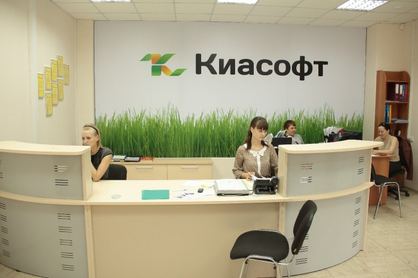

# Киасофт - лидер в области системной интеграции

Дата создания: 2013-12-30

Автор: Kiasoft

Теги: системный интегратор

Компания " **Киасофт**" — это профессиональная команда квалифицированных специалистов по продаже, сопровождению и внедрению широкого спектра программного обеспечения и оборудования. Компания успешно работает в сфере информационных технологий начиная с 2004 года и является официальным партнером фирм: 1С, Лаборатория Касперского, Microsoft, ГАРАНТ, Крипто-Про, Атол, Доктор Веб, БАРС ГРУПП, ЭОС, 1С-БИТРИКС, ESET, Adobe, Abbyy, Инфотекс, ГК ГРАНД, Аладин, Гарант-Электронный Экспресс, Калуга Астрал, DEPO, HP, IBM, DELL, D-link.  
  
Богатый практический опыт работы — гарантия оперативного, профессионального и эффективного решения задач наших клиентов.  
  
Направления деятельности компании включают в себя комплексную автоматизацию предприятий бюджетной сферы, розничной и оптовой торговли, производства, поставку и сопровождение широкого спектра программного обеспечения, торгового оборудования и компьютерной технике, систем видео наблюдения, выдачу ЭЦП, монтаж компьютерных сетей.  
  
Цель компании « **Киасофт** » — предоставление полного спектра услуг, программного обеспечения и оборудования для автоматизации предприятий различных форм собственности.  
   
  
 

