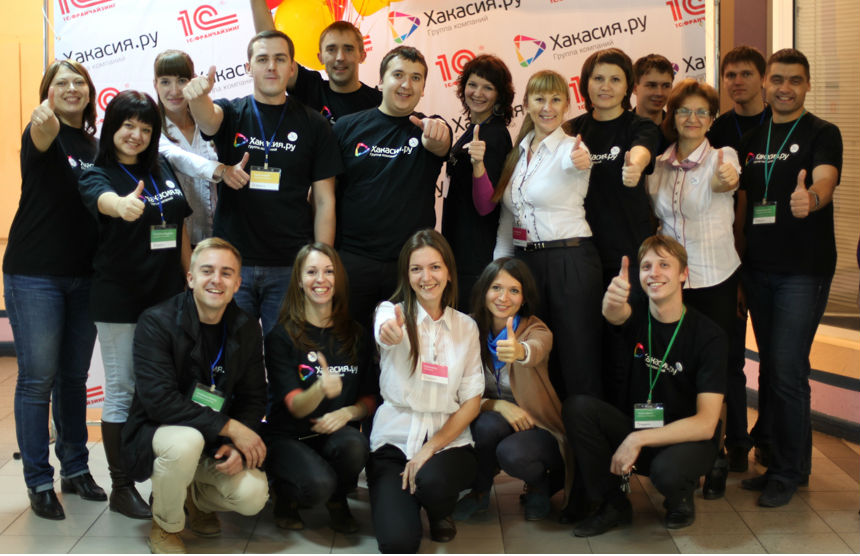
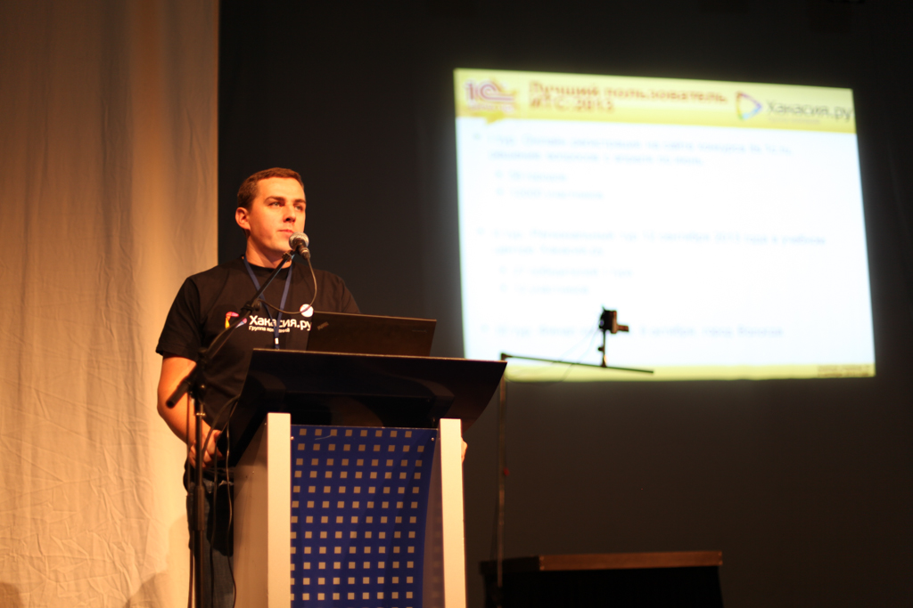
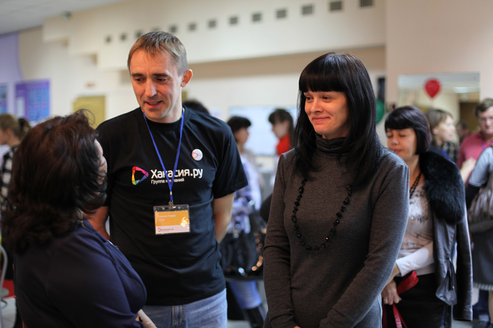
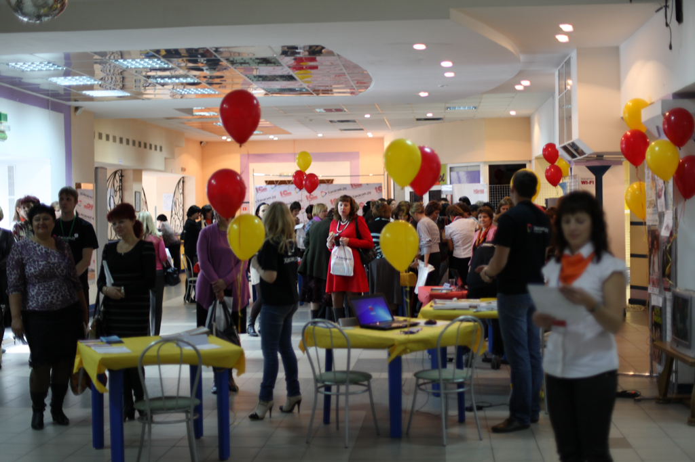
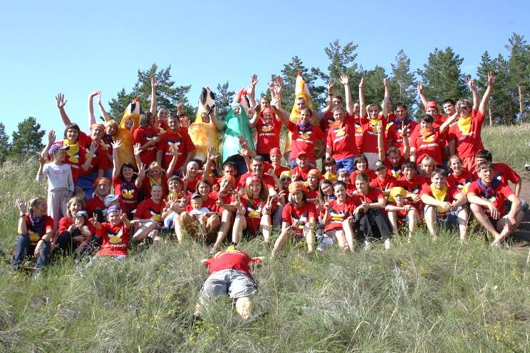
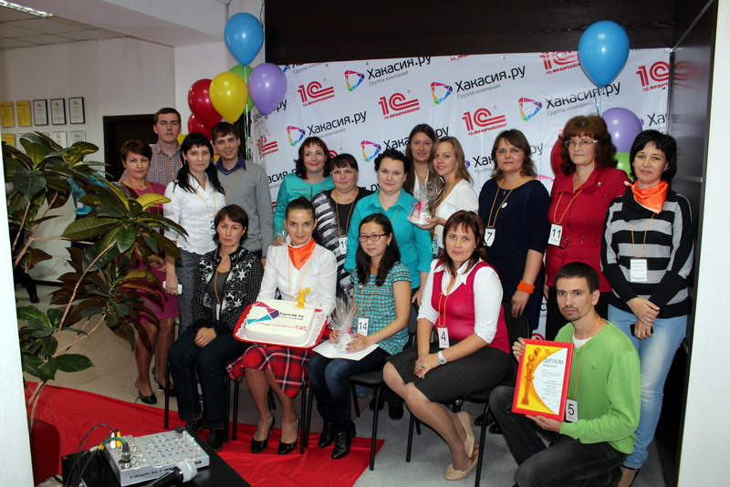

# Хакасия.ру: главное, чтобы клиент был доволен!

Дата создания: 2014-01-14

Автор: kostya-pakhomov

Теги: Хакасия.ру,Компании

 

 

 

 

 

 Идея «Хакасии.ру» зародилась в далеком (уже) **2000 году** из интереса к ИТ-сфере и большого желания сделать что-то стоящее, быть полезным для клиентов и предвосхищать их ожидания. С тех пор мы много экспериментировали с направлениями и проектами, развивали интернет-сайты, разрабатывали ПО, обслуживали и внедряли 1С.  
  
Так сложилось, что довольно быстро на технологии фирмы «1С» сфокусировали на себе все наше внимание. За замечаниями друзей о том, что писать программы на русском языке – это несерьёзно, мы видели конкретные задачи. Бизнес-задачи наших клиентов, их потребности и перспективы, точки роста и необходимые улучшения. Благодарность при решении вопроса, негодование при несоблюдении сроков, и самое главное – изменения, к которым ты причастен.   
  
Вскоре родилась и уникальная (по меркам других регионов) схема работы в рамках безлимитного абонентского договора. Она заключается в том, что клиент заранее прогнозирует бюджет на услуги, а сотрудник заинтересован все сделать быстро и качественно. Правила построения этой схемы до сих пор вызывают горячие споры и неподкупный интерес коллег на любой конференции.   
  
С 2007 года компания начала развитие дополнительных сервисов для клиентов. Практически каждый год мы запускали новое направление, предлагали новые услуги и улучшали действующие. Сегодня [**Группа компаний «Хакасия.ру»**](http://www.khakasia.ru) работает по нескольким направлениям:

1. Внедрение и сопровождение 1С
2. Разработка сайтов
3. Системы электронного документооборота
4. Учебный центр
5. ИТ-аутсорсинг
6. Интернет-проект «[Репаблик](http://www.r19.ru)»

  
Сотрудники компании работают в двух офисах: в Абакане и Саяногорске.  
  
Естественно, останавливаться мы не собираемся, в работе еще несколько проектов и направлений. Внутренняя среда компании также постоянно развивается, и сейчас мы готовы предложить новым сотрудникам профессиональное развитие на базе корпоративного университета.   
  
Интересные задачи есть всегда, главное – желание и вера в себя. И если получается сделать команду и клиентов счастливее, то и мир вокруг становится лучше.  
  
_Ждем в гости!_